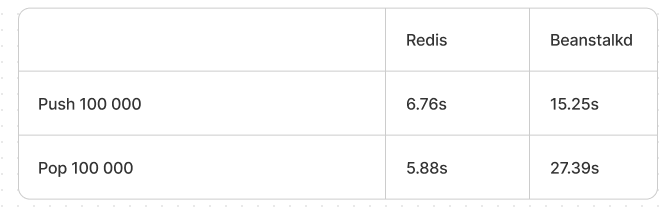
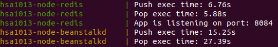

# Redis vs Beanctalkd perfomance comparison

To start application run the simple command:

```bash
docker-compose up
```

It will run the applications:

  * [API Server that works with redis](http://localhost:8084/) on port `8084`
  * [API Server that works with beanstalkd](http://localhost:8085/) on port `8085`
  * [Redis(1 node)](http://localhost:6373/) on port `6373`
  * [Beanstalkd(1 node)](http://localhost:11301/) on port `11301`

## API Usage

* Open link in a browser to push a random string in a queue [http://localhost:8084/push](http://localhost:8084/push)
* Open link in a browser to pull a random string from a queue [http://localhost:8084/pop](http://localhost:8084/pop)
* Make a curl request 
  ```bash
  curl --location --request GET 'http://localhost:8084/push'
  curl --location --request GET 'http://localhost:8084/pop'
  ```
* Open link in a browser to push a random string in a queue [http://localhost:8085/push](http://localhost:8085/push)
* Open link in a browser to pull a random string from a queue [http://localhost:8085/pop](http://localhost:8085/pop)
* Make a curl request 
  ```bash
  curl --location --request GET 'http://localhost:8085/push'
  curl --location --request GET 'http://localhost:8085/pop'
  ```

## Perfomance comparison table



## Perfomance on startup


